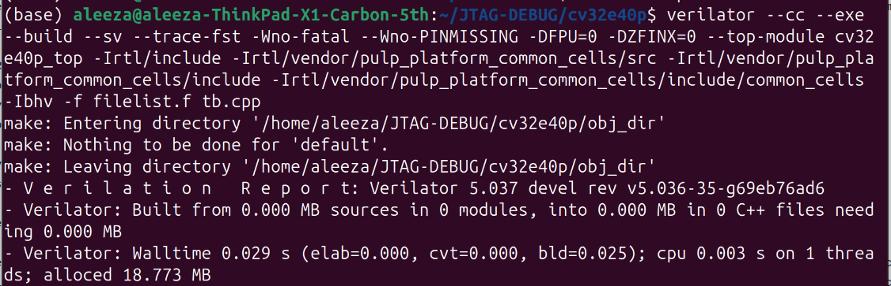
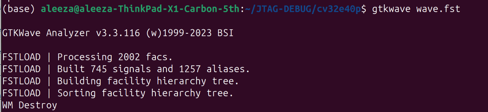
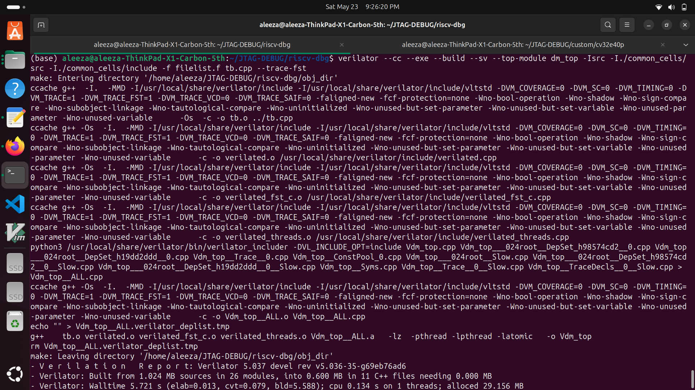
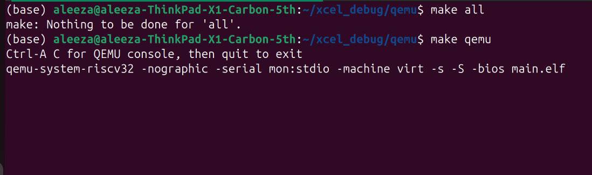
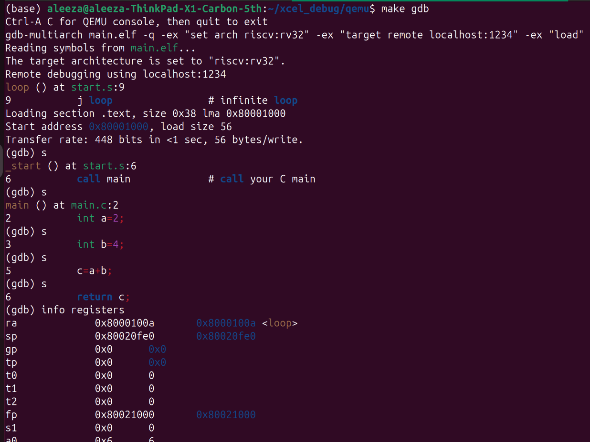

# JTAG-DEBUG

## 1. Verilating and Simulating CV32E40P Core using Verilator

## Overview

The goal of this task was to successfully verilate and simulate the `CV32E40P` RISC-V core using Verilator.
core link: `https://github.com/openhwgroup/cv32e40p.git`
The process included:
- Preparing the RTL source list
- Resolving Verilator compilation issues
- Writing a C++ testbench
- Viewing simulation results in GTKWave

## Work

The work started by targeting the top-level module `cv32e40p_top`. A `filelist.f` approach was used for compilation instead of manually listing RTL files in the command. The filelist contained:

- RTL source files
- package files
- vendor/common-cell dependencies
- behavioral models
  
Several issues were encountered and corrected to make it verilator compatible and filelist is made containing only the required files for verilator-based simulation.

### RTL Modifications

During Verilator compilation of the CV32E40P core, multiple errors were encountered related to mixed assignment styles inside generate blocks and unsupported RTL patterns. These were fixed to ensure successful simulation.

For example, all conflicting signals were unified to **sequential logic (`always_ff`) only**, and `assign` statements were removed or replaced with reset logic in `rtl/cv32e40p_cs_registers.sv`.

The command used to verilate is:
```bash
 verilator --cc --exe --build --sv --trace-fst -Wno-fatal --Wno-PINMISSING -DFPU=0 -DZFINX=0 --top-module cv32e40p_top -Irtl/include -Irtl/vendor/pulp_platform_common_cells/src -Irtl/vendor/pulp_platform_common_cells/include -Irtl/vendor/pulp_platform_common_cells/include/common_cells -Ibhv -f filelist.f tb.cpp
```


Then run this command:
```bash
./obj_dir/Vcv32e40p_top
gtkwave wave.fst
```


So, the core cv32e40p is successfully compiled and simulated on verilator and waveforms can be analyzed in gtkwave

## 2. Verilating and Simulating riscv-dbg (debug module) using Verilator

Command used for compiling:
```
verilator --cc --sv --top-module dm_top -Isrc -I./common_cells/src -I./common_cells/include -I.common_cells/src/cdc_reset_ctrlr_pkg.sv -f filelist.f --Wno-fatal --Wno-PINMISSING --Wno-WIDTHEXPAND
```
For simulating:
Some modification in `src/dm_mem.sv`

Command used:
```
verilator --cc --exe --build --sv --top-module dm_top -Isrc -I./common_cells/src -I./common_cells/include -f filelist.f tb.cpp --trace-fst
```


## 3. debug module inside cv32e40p

filelist is also in cv32e40p directory.

command for compiling that:

```bash
verilator --cc --sv --top-module dm_top -I. -Isrc -I./riscv-dbg/src -I./riscv-dbg/tb -I./common_cells/include -I./common_cells/src -I./riscv-dbg/common_cells/include -f filelist.f --Wno-fatal --Wno-PINMISSING --Wno-WIDTHEXPAND
```

command for simulating:

```bash
verilator --cc --exe --build --sv \
  --top-module dm_top \
  -I. \
  -Isrc \
  -I./riscv-dbg/src \
  -I./riscv-dbg/tb \
  -I./common_cells/include \
  -I./common_cells/src \
  -I./riscv-dbg/common_cells/include \
  -f filelist.f \
  tb.cpp \
  --trace-fst \
  --Wno-fatal \
  --Wno-PINMISSING \
  --Wno-WIDTHEXPAND
```

then, run
```bash
./obj_dir/Vdm_top`
```

To view waves:
```bash
gtkwave wave.fst
```

## 4. All Integrated

- resolved some naming errors
- added 2 missing files `tc_clk_inverter` and `tc_clk_mux2`

1. For compiling and simulating:
```bash
verilator --cc --exe --build --sv --trace-fst -Wno-fatal --Wno-PINMISSING -DFPU=0 -DZFINX=0 --top-module jtag_top -I. -Isrc -I./riscv-dbg/src -I./riscv-dbg/tb -I./common_cells/include -I./common_cells/src -I./riscv-dbg/common_cells/include -Irtl/include -Irtl/vendor/pulp_platform_common_cells/src -Irtl/vendor/pulp_platform_common_cells/include -Irtl/vendor/pulp_platform_common_cells/include/common_cells -Ibhv -f filelist.f tb.cpp
```
2. Run
```bash
./obj_dir/Vjtag_top
```
3. To see the waves:
```bash
gtkwave phase1_waves.fst
```

## 5. Elaboration + Code generation -sc command

```
verilator --sc --sv \
-Wno-fatal \
-Wno-PINMISSING \
-Wno-UNOPTFLAT \
-Wno-CASEINCOMPLETE \
-Wno-SYMRSVDWORD \
-Wno-COMBDLY \
-DFPU=0 \
-DZFINX=0 \
--top-module jtag_top \
-I. \
-Isrc \
-I./riscv-dbg/src \
-I./riscv-dbg/tb \
-I./common_cells/include \
-I./common_cells/src \
-I./riscv-dbg/common_cells/include \
-Irtl/include \
-Irtl/vendor/pulp_platform_common_cells/src \
-Irtl/vendor/pulp_platform_common_cells/include \
-Irtl/vendor/pulp_platform_common_cells/include/common_cells \
-Ibhv \
-f filelist.f
```
- Compile verilator output:

```
make -C obj_dir -f Vjtag_top.mk
```

```
(base) aleeza@aleeza-ThinkPad-X1-Carbon-5th:~/JTAG-DEBUG/cv32e40p$ sed -n '40,80p' obj_dir/Vjtag_top.h
    sc_core::sc_out<bool> &td_o;

    // CELLS
    // Public to allow access to /* verilator public */ items.
    // Otherwise the application code can consider these internals.

    // Root instance pointer to allow access to model internals,
    // including inlined /* verilator public_flat_* */ items.
    Vjtag_top___024root* const rootp;

    // CONSTRUCTORS
    SC_CTOR(Vjtag_top);
    virtual ~Vjtag_top();
  private:
    VL_UNCOPYABLE(Vjtag_top);  ///< Copying not allowed

  public:
    // API METHODS
  private:
    void eval() { eval_step(); }
    void eval_step();
  public:
    void final();
    /// Are there scheduled events to handle?
    bool eventsPending();
    /// Returns time at next time slot. Aborts if !eventsPending()
    uint64_t nextTimeSlot();

    /// DPI Export functions
    static int read_byte(const svLogicVecVal* byte_addr);
    static void write_byte(const svLogicVecVal* byte_addr, const svLogicVecVal* val, svLogicVecVal* other);

    // Abstract methods from VerilatedModel
    const char* hierName() const override final;
    const char* modelName() const override final;
    unsigned threads() const override final;
    /// Prepare for cloning the model at the process level (e.g. fork in Linux)
    /// Release necessary resources. Called before cloning.
    void prepareClone() const;
    /// Re-init after cloning the model at the process level (e.g. fork in Linux)
    /// Re-allocate necessary resources. Called after cloning.
(base) aleeza@aleeza-ThinkPad-X1-Carbon-5th:~/JTAG-DEBUG/cv32e40p$ grep -n "eval_step" obj_dir/Vjtag_top.h
59:    void eval() { eval_step(); }
60:    void eval_step();
(base) aleeza@aleeza-ThinkPad-X1-Carbon-5th:~/JTAG-DEBUG/cv32e40p$ grep -n "eval()" obj_dir/Vjtag_top.h
59:    void eval() { eval_step(); }
(base) aleeza@aleeza-ThinkPad-X1-Carbo

```

This shows that generated model is `SC_CTOR(Vjtag_top);` and `void eval_step();` rakhta hai, isliye ye proper SystemC module hai.

Compilation + Linking:
```
verilator --sc --sv \
-Wno-fatal \
-Wno-PINMISSING \
-Wno-UNOPTFLAT \
-Wno-CASEINCOMPLETE \
-Wno-SYMRSVDWORD \
-Wno-COMBDLY \
-DFPU=0 \
-DZFINX=0 \
--top-module jtag_top \
-I. \
-Isrc \
-I./riscv-dbg/src \
-I./riscv-dbg/tb \
-I./common_cells/include \
-I./common_cells/src \
-I./riscv-dbg/common_cells/include \
-Irtl/include \
-Irtl/vendor/pulp_platform_common_cells/src \
-Irtl/vendor/pulp_platform_common_cells/include \
-Irtl/vendor/pulp_platform_common_cells/include/common_cells \
-Ibhv \
-f filelist.f
```


## 6. QEMU + GDB Debugging Workflow (RISC-V Bare Metal)
## Overview
This setup demonstrates running a simple RISC-V bare-metal program on QEMU and debugging it using GDB in a step-by-step execution mode. The goal is to observe program execution and register state changes at runtime.
## Prerequisites
RISC-V cross compiler toolchain (riscv64-unknown-elf-gcc)
QEMU with RISC-V support (qemu-system-riscv32)
GDB with RISC-V support (gdb-multiarch)

### Build Process

Compile the program:
```
make all
```

This generates `main.elf` → executable firmware image

### Run QEMU (Debug Mode)

Start QEMU in debug mode:
```
make qemu
```



### Connect GDB

Open a new terminal and start GDB:
```
make gdb
```

Then run the program step-by-step by using **`s`** command and finally see the state of registers
```
info registers
```

